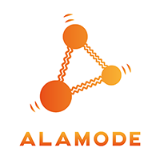

# ALAMODE 
### Version 0.9.8 (Beta)


- - -

## Introduction 

ALAMODE is a scientific software designed for analyzing lattice anharmonicity
and  lattice thermal conductivity of solids. By using an external DFT package
such as  VASP and Quantum ESPRESSO, you can extract harmonic and anharmonic
force constants  straightforwardly with ALAMODE. Using the calculated anharmonic
force constants, you can also estimate lattice thermal conductivity, phonon
linewidth, and other anharmonic phonon properties from first principles.

## Features


### General
* Extraction of harmonic and anharmonic force constants based on the supercell approach
* Applicable to any crystal structures and low-dimensional systems
* Accurate treatment of translational and rotational invariance
* Interface to VASP, Quantum-ESPRESSO, and xTAPP codes
* Parallelization with MPI+OpenMP

### Harmonic properties

* Phonon dispersion
* Phonon DOS, atom-projected phonon DOS
* Two-phonon DOS
* Vibrational thermodynamic functions (heat capacity, entropy, free energy)
* Mean-square displacement
* Animation and visualization of phonon modes (requires VMD or XCrysDen)
* 3-phonon scattering phase space
* Phonon-isotope scattering rate
* Participation ratio for analyzing localization of phonon modes


### Anharmonic properties
* Gruneisen parameter via cubic force constants
* Lattice thermal conductivity by BTE-RTA
* Cumulative thermal conductivity
* Phonon linewidth due to 3-phonon interactions
* Phonon frequency shift due to 3- and 4-phonon interactions
* Temperature-dependent effective potential method

## Prerequisite
* C++ compiler
* LAPACK libarary
* MPI library
* Boost C++ library

## Download

You can download the latest and previous versions of ALAMODE 
at http://sourceforge.net/projects/alamode .

You can also clone the repository as

```
$ git clone http://github.com/ttadano/alamode.git
```

If you download the github version, please use the 'master' branch.

## Install
The directories alm/, anphon/, and tools/ contain separate Makefiles.
Please modify the Makefiles appropriately by changing variables such as 
CXX, CXXFLAGS, or MPICXX. Then, execute "make" will create the binary for
each program.


## Documentation
For more details about ALAMODE including tutorial, input parameters, and 
output files, please visit the following webpabe.

http://alamode.readthedocs.io


## License
Copyright (c) 2014, 2015, 2016 Terumasa Tadano
This software is released under the MIT license. 
For license rights and limitations, see LICENSE.txt file.

## Author
Terumasa Tadano (The University of Tokyo, Japan)
